<div align="center">

# 🐦 **Twitter Clone API**

[](https://nodejs.org/)
[](https://www.typescriptlang.org/)
[](https://www.mongodb.com/)
[](https://expressjs.com/)
[](LICENSE)

_A comprehensive RESTful API backend for a Twitter-like social media platform_

[🚀 **Quick Start**](#-getting-started) • [📡 **API Docs**](#-api-endpoints) • [🛠️ **Tech Stack**](#️-technologies-used) • [📁 **Project Structure**](#-project-structure) • [🖥️ **Frontend Client**](https://github.com/Kenn0679/Twitter_Client)

---

### 👋 About the Developer

**Hi, I'm Ken!** 👨‍💻

I'm a passionate student developer currently pursuing my studies in software engineering. This Twitter Clone API is my personal project built from the ground up to demonstrate modern backend development practices and full-stack capabilities.

**What drove me to build this:**

- Deep dive into **real-world API architecture**
- Master **TypeScript**, **Node.js**, and **MongoDB**
- Implement **scalable video streaming** (HLS & Range requests)
- Learn **OAuth 2.0**, **JWT authentication**, and **security best practices**

I hope this project inspires fellow developers and serves as a practical reference for building production-ready APIs. Feel free to explore, learn, and contribute! 🚀

**⭐ If you find this project helpful, please consider giving it a star!**

---

</div>

---

## **📖 Project Description**

This project is a **comprehensive backend API** that replicates core Twitter functionalities, including user authentication, profile management, social features (follow/unfollow), and media uploads. Built with modern Node.js technologies and follows best practices for scalable API development.

> 💡 **Built with modern architecture patterns and production-ready features**

## **✨ Key Features**

<table>
<tr>
<td width="50%">

### 🔐 **Authentication & Security**

- JWT-based authentication with access/refresh tokens
- Email verification & password reset flow
- OAuth2.0 Google login integration
- Password hashing & security middleware

</td>
<td width="50%">

### 👤 **User Management**

- Complete CRUD operations for profiles
- Bio, avatar, cover photo management
- Username customization & validation
- Location & website information

</td>
</tr>
<tr>
<td width="50%">

### 🤝 **Social Features**

- Follow/unfollow system
- Twitter Circle (close friends list)
- User profile viewing & discovery
- Social graph management

</td>
<td width="50%">

### 📸 **Media Processing**

- Image upload with Sharp optimization
- Automatic format conversion to JPEG
- Quality compression & resizing
- Secure file handling

</td>
</tr>
<tr>
<td width="50%">

### ✅ **Validation & Error Handling**

- Request validation with express-validator
- Centralized error handling
- Consistent API responses
- Input sanitization

</td>
<td width="50%">

### 🚀 **Performance & Scalability**

- TypeScript for type safety
- Modern Node.js architecture
- MongoDB for flexible data storage
- Production-ready configuration

</td>
</tr>
</table>

## **🛠️ Technologies Used**

<div align="center">

### **Tech Stack Overview**

| Category      | Technology                                                                                                        | Purpose                         |
| ------------- | ----------------------------------------------------------------------------------------------------------------- | ------------------------------- |
| **Runtime**   |         | JavaScript runtime environment  |
| **Framework** |     | Web application framework       |
| **Language**  |  | Type-safe JavaScript superset   |
| **Database**  |           | NoSQL database for data storage |

</div>

### **🔧 Core Technologies**

<table>
<tr>
<td width="33%">

#### **Backend Framework & Runtime**

- 🟢 **Node.js** - JavaScript runtime environment
- ⚡ **Express.js** - Web application framework
- 🔷 **TypeScript** - Type-safe JavaScript superset

</td>
<td width="33%">

#### **Database & Storage**

- 🍃 **MongoDB** - NoSQL database for data storage
- 📊 **MongoDB Driver** - Native MongoDB driver for Node.js

</td>
<td width="33%">

#### **Authentication & Security**

- 🔐 **JWT** - Token-based authentication
- 🔒 **bcrypt** - Password hashing
- 🛡️ **CORS** - Cross-origin resource sharing

</td>
</tr>
<tr>
<td width="33%">

#### **Media Processing**

- 📸 **Sharp** - High-performance image processing
- 📤 **Formidable** - File upload handling
- 🖼️ **Image optimization** - Auto compression

</td>
<td width="33%">

#### **Validation & Utilities**

- ✅ **express-validator** - Request validation
- 🧰 **Lodash** - Utility functions
- 🌐 **Axios** - HTTP client for OAuth
- 🔧 **dotenv** - Environment variables

</td>
<td width="33%">

#### **Development Tools**

- 🔍 **ESLint** - Code linting
- 💅 **Prettier** - Code formatting
- 🔄 **Nodemon** - Auto-restart dev server
- ⚙️ **TSC & tsc-alias** - TypeScript compilation

</td>
</tr>
</table>

## **📁 Project Structure**



```mermaid
graph TD
    A[src/] --> B[constants/]
    A --> C[controllers/]
    A --> D[middlewares/]
    A --> E[models/]
    A --> F[routes/]
    A --> G[services/]
    A --> H[utils/]

    B --> B1[Enums & Constants]
    B --> B2[HTTP Status Codes]
    B --> B3[Regex Patterns]

    C --> C1[User Controller]
    C --> C2[Media Controller]
    C --> C3[Auth Controller]

    D --> D1[Validation Middleware]
    D --> D2[Authentication Middleware]
    D --> D3[Error Handling]

    E --> E1[User Data Model]
    E --> E2[RefreshToken Data Model]
    E --> E3[Follower Data Model]

    F --> F1[User Routes]
    F --> F2[Media Routes]
    F --> F3[Auth Routes]

    G --> G1[Database Service]
    G --> G2[User Service]
    G --> G3[Media Service]

    H --> H1[JWT Utils]
    H --> H2[Crypto Utils]
    H --> H3[File Handling]
```

### **📂 Directory Breakdown**

| Directory          | Purpose                      | Key Files                                   |
| ------------------ | ---------------------------- | ------------------------------------------- |
| **`constants/`**   | 🎯 Configuration & constants | Enums, HTTP status codes, regex patterns    |
| **`controllers/`** | 🎮 Request handlers          | User, media, and authentication controllers |
| **`middlewares/`** | 🛡️ Request processing        | Validation, auth, error handling middleware |
| **`models/`**      | 🗃️ Database schemas          | User, RefreshToken, Follower data models    |
| **`routes/`**      | 🛣️ API endpoints             | Route definitions and path configurations   |
| **`services/`**    | ⚙️ Business logic            | Database, user, and media service layers    |
| **`utils/`**       | 🔧 Helper functions          | JWT, crypto, and file handling utilities    |

## **🚀 Getting Started**

### **📋 Prerequisites**

<div align="center">

| Requirement                                                                                | Version | Purpose            |
| ------------------------------------------------------------------------------------------ | ------- | ------------------ |
|   | v16+    | JavaScript runtime |
|  | v6.0+   | Database           |
|                  | v8+     | Package manager    |

</div>

### **⚡ Quick Installation**

```bash
# 1️⃣ Clone the repository
git clone https://github.com/yourusername/twitter-clone-api.git
cd twitter-clone-api

# 2️⃣ Install dependencies
npm install

# 3️⃣ Set up environment variables
cp .env.example .env
# Edit .env with your configuration

# 4️⃣ Start development server
npm run dev
```

### **🔧 Environment Setup**

**Important:** You need to configure environment variables before running the application.

#### **Step 1: Create your environment file**

```bash
# Copy the example environment file
cp .env.example .env
```

#### **Step 2: Configure your variables**

Open the newly created `.env` file and fill in your actual values:

```env
# Server Configuration
PORT=4000                                    # Change if needed
BASE_URL=http://localhost:4000               # Your server URL

# Database Configuration (MongoDB Atlas)
DB_USER=your-actual-mongodb-username         # ⚠️ Replace with your MongoDB Atlas username
DB_PASS=your-actual-mongodb-password         # ⚠️ Replace with your MongoDB Atlas password
DB_NAME=twitter_clone                        # Database name
DB_USER_COLLECTION=users                     # Keep as is
DB_REFRESH_TOKEN_COLLECTION=refresh_tokens   # Keep as is
DB_FOLLOWERS_COLLECTION=followers            # Keep as is

# JWT Configuration
JWT_SECRET=your-super-secret-jwt-key-here                    # ⚠️ Generate a strong random string
JWT_SECRET_REFRESH_TOKEN=your-super-secret-refresh-key-here  # ⚠️ Generate a strong random string
JWT_SECRET_EMAIL_VERIFY_TOKEN=your-email-verify-secret-here  # ⚠️ Generate a strong random string
JWT_SECRET_FORGOT_PASSWORD_TOKEN=your-forgot-password-secret # ⚠️ Generate a strong random string

# Password Hashing
PASSWORD_SECRET=your-password-hash-secret-here               # ⚠️ Generate a strong random string

# OAuth Configuration (Optional)
GOOGLE_CLIENT_ID=your-google-client-id-here                  # Optional: Only if using Google OAuth
GOOGLE_CLIENT_SECRET=your-google-client-secret-here          # Optional: Only if using Google OAuth
GOOGLE_REDIRECT_URI=http://localhost:4000/users/oauth/google
CLIENT_REDIRECT_CALLBACK=http://localhost:3000/login/oauth
```

#### **Step 3: Get MongoDB Atlas Credentials**

1. Go to [MongoDB Atlas](https://www.mongodb.com/cloud/atlas)
2. Create a free cluster (if you haven't already)
3. Go to **Database Access** → Create database user → Note the username and password
4. Go to **Network Access** → Add your IP address (or `0.0.0.0/0` for development)
5. Update `DB_USER` and `DB_PASS` in your `.env` file

#### **Step 4: Generate Secret Keys**

You can generate strong random strings for JWT secrets using Node.js:

```bash
node -e "console.log(require('crypto').randomBytes(32).toString('hex'))"
```

Run this command multiple times and use different outputs for each secret.

> 💡 **Tip:** Never commit your `.env` file to Git! It's already in `.gitignore`.

### **📜 Available Scripts**

<div align="center">

| Script              | Command                | Description                      |
| ------------------- | ---------------------- | -------------------------------- |
| 🚀 **Development**  | `npm run dev`          | Start dev server with hot reload |
| 🏗️ **Build**        | `npm run build`        | Compile TypeScript to JavaScript |
| 🎯 **Production**   | `npm start`            | Run production build             |
| 🔍 **Lint**         | `npm run lint`         | Check code quality               |
| 🔧 **Lint Fix**     | `npm run lint:fix`     | Auto-fix linting issues          |
| 💅 **Prettier**     | `npm run prettier`     | Check code formatting            |
| ✨ **Prettier Fix** | `npm run prettier:fix` | Auto-fix formatting              |

</div>

## **📡 API Endpoints**

<div align="center">

### **API Documentation Overview**

| Category               | Endpoints   | Description                                 |
| ---------------------- | ----------- | ------------------------------------------- |
| 🔐 **Authentication**  | 9 endpoints | Login, register, OAuth, password management |
| 👤 **User Management** | 6 endpoints | Profile CRUD, follow system, user discovery |
| 📸 **Media Upload**    | 1 endpoint  | Image upload and processing                 |

</div>

### **🔐 Authentication Routes** (`/users`)

<table>
<tr>
<td width="50%">

#### **🔑 Core Authentication**

- `POST /login` - User login
- `POST /register` - User registration
- `POST /logout` - User logout
- `POST /refresh-token` - Refresh access token

#### **📧 Email Verification**

- `POST /verify-email` - Verify email address
- `POST /resend-verify-email` - Resend verification email

</td>
<td width="50%">

#### **🔒 Password Management**

- `POST /forgot-password` - Request password reset
- `POST /verify-forgot-password` - Verify reset token
- `POST /reset-password` - Reset password
- `PUT /change-password` - Change password

#### **🌐 OAuth Integration**

- `GET /oauth/google` - Google OAuth login

</td>
</tr>
</table>

### **👤 User Management Routes** (`/users`)

<table>
<tr>
<td width="50%">

#### **👤 Profile Management**

- `GET /me` - Get current user profile
- `PATCH /me` - Update user profile
- `GET /:username` - Get user profile by username

</td>
<td width="50%">

#### **🤝 Social Features**

- `POST /follow` - Follow a user
- `DELETE /follow/:user_id` - Unfollow a user

</td>
</tr>
</table>

### **📸 Media Routes** (`/medias`)

<table>
<tr>
<td width="100%">

#### **🖼️ Media Processing**

- `POST /upload-image` - Upload and process image with optimization

</td>
</tr>
</table>

### **📊 API Response Examples**

<details>
<summary><strong>🔍 View API Response Examples</strong></summary>

#### **Successful Login Response**

```json
{
  "success": true,
  "message": "Login successful",
  "data": {
    "user": {
      "id": "64a1b2c3d4e5f6789abcdef0",
      "username": "johndoe",
      "email": "john@example.com",
      "avatar": "https://example.com/avatar.jpg"
    },
    "tokens": {
      "accessToken": "eyJhbGciOiJIUzI1NiIsInR5cCI6IkpXVCJ9...",
      "refreshToken": "eyJhbGciOiJIUzI1NiIsInR5cCI6IkpXVCJ9..."
    }
  }
}
```

#### **Error Response**

```json
{
  "success": false,
  "message": "Validation error",
  "errors": [
    {
      "field": "email",
      "message": "Invalid email format"
    }
  ]
}
```

</details>

## **🔒 Authentication Flow**

1. User registers with email/password or Google OAuth
2. Email verification token sent to user's email
3. User verifies email to activate account
4. Login returns access token (short-lived) and refresh token (long-lived)
5. Protected routes require valid access token
6. Refresh token used to obtain new access token when expired

## **📝 Database Models**

- **User**: Profile information, credentials, verification status
- **RefreshToken**: JWT refresh tokens for session management
- **Follower**: Social graph relationships between users

---

## **🚧 In Progress**

The following features are currently under development:

- **Tweet/Post System**: Create, read, update, delete tweets
- **Tweet Interactions**: Like, retweet, reply functionality
- **Hashtag System**: Hashtag parsing and trending topics
- **Notification System**: Real-time notifications for user interactions
- **Direct Messaging**: Private messaging between users
- **Search Functionality**: Search users, tweets, and hashtags
- **Video Upload**: Support for video media upload and processing
- **Rate Limiting**: API rate limiting for security
- **Pagination**: Cursor-based pagination for feeds
- **Unit & Integration Tests**: Comprehensive test coverage

---
