<div align="center">

# 🐦 **Twitter Clone API**

[](https://nodejs.org/)
[](https://www.typescriptlang.org/)
[](https://www.mongodb.com/)
[](https://expressjs.com/)
[](LICENSE)

_A production-ready RESTful API backend for a Twitter-like social media platform_

[🚀 Quick Start](#-getting-started) • [📡 API Docs](#-api-endpoints) • [🛠️ Tech Stack](#️-technologies-used) • [📁 Structure](#-project-structure) • [🖥️ Frontend Client](https://github.com/Kenn0679/Twitter_Client)

---

### 👋 **Meet the Developer**

**Hi, I'm Ken!** 👨‍💻

I'm a passionate software engineering student with a drive to build scalable, production-ready applications. This Twitter Clone API represents my journey in mastering modern backend development and full-stack engineering.

**Why I Built This:**

- 🎯 Deep dive into **enterprise-level API architecture**
- 🚀 Master **TypeScript**, **Node.js**, and **MongoDB** at scale
- 🎬 Implement **advanced video streaming** with HLS & adaptive bitrate
- 🔐 Learn **OAuth 2.0**, **JWT authentication**, and **industry-standard security**

I built this project to demonstrate real-world development skills and to serve as a comprehensive reference for aspiring developers. Feel free to explore, learn, fork, and contribute!

**⭐ If this project helps you, please star the repo! Your support means a lot.**

---

</div>

## **📖 Overview**

This is a **comprehensive, production-ready backend API** that faithfully replicates Twitter's core functionality. Built with modern Node.js technologies and architectural best practices, this API handles everything from user authentication to media streaming, social interactions, and real-time content delivery.

> 💡 **Enterprise-grade architecture with scalability, security, and performance in mind**

---

## **✨ Feature Showcase**

<table>
<tr>
<td width="50%" valign="top">

### #️⃣ **Hashtag System**

**Trending and discovery**

- Automatic hashtag extraction from tweets
- Hashtag indexing and search
- Trending topics detection (coming soon)
- Hashtag-based tweet filtering
- Real-time hashtag analytics (planned)

</td>
<td width="50%" valign="top">

### 📝 **Tweet/Post System**

**Rich content creation**

- Create tweets with media attachments
- Support for hashtags with auto-detection
- @mention system for user tagging
- Media attachments (images & videos)
- Audience targeting (public, Twitter Circle)
- Tweet types (Tweet, Retweet, Comment, QuoteTweet)
- View count tracking (authenticated & guest)
- News feed with pagination
- Tweet children (replies, retweets, quotes)

</td>
</tr>
<tr>
<td width="50%" valign="top">

### 🔐 **Authentication & Security**

**Rock-solid authentication system**

- JWT-based auth with access/refresh token rotation
- Email verification with secure token generation
- Password reset flow with time-limited tokens
- OAuth 2.0 Google login integration
- Password hashing with custom secret
- CORS and security middleware (Helmet)
- Rate limiting with express-slow-down

</td>
<td width="50%" valign="top">

### 👤 **User Management**

**Complete profile system**

- Full CRUD operations for user profiles
- Avatar and cover photo management
- Bio, location, website, and personal info
- Username customization with validation
- Public profile discovery by username
- Account verification status
- Get other users for chat functionality

</td>
</tr>
<tr>
<td width="50%" valign="top">

### 🤝 **Social Features**

**Build meaningful connections**

- Follow/unfollow system
- Twitter Circle (close friends feature)
- User discovery
- Social graph management
- Privacy controls

</td>
<td width="50%" valign="top">

### 💬 **Real-time Messaging**

**Socket.IO powered chat**

- Real-time private messaging
- Typing indicators
- Online/offline status tracking
- Message status (sent, received, read)
- Conversation management
- User presence tracking

</td>
</tr>
<tr>
<td width="50%" valign="top">

### 🔖 **Bookmarks & Likes**

**Content engagement**

- Save tweets to bookmarks
- Like/unlike tweets
- Multiple ways to remove bookmarks/likes
- Track user engagement

</td>
<td width="50%" valign="top">

### 🔍 **Search Functionality**

**Discover content**

- Search tweets by content
- Full-text search with MongoDB indexing
- Paginated search results
- Search users (planned)

</td>
</tr>
<tr>
<td width="50%" valign="top">

### 📸 **Media Processing & Cloud Storage**

**Advanced media handling**

- Direct upload to Amazon S3
- Video streaming with HLS (HTTP Live Streaming)
- Adaptive bitrate streaming
- Automatic format conversion and optimization
- Image compression and resizing with Sharp
- Support for multiple image formats
- Secure signed URLs
- Chunked upload for large files

</td>
<td width="50%" valign="top">

### ✅ **Validation & Error Handling**

**Bulletproof request processing**

- Request validation with express-validator
- Centralized error handling middleware
- Consistent API response format
- Input sanitization and XSS protection
- Type-safe with TypeScript
- Detailed error messages for debugging
- HTTP status code standards

</td>
</tr>
<tr>
<td width="50%" valign="top">

### 🚀 **Performance & Scalability**

**Built for growth**

- TypeScript for type safety and maintainability
- Async/await patterns throughout
- Efficient MongoDB indexing strategies
- Connection pooling for database
- Environment-based configuration
- Production-ready architecture
- Modular and maintainable codebase

</td>
<td width="50%" valign="top">

### 🎬 **Video Streaming**

**Professional-grade streaming**

- HLS (HTTP Live Streaming) protocol
- Adaptive bitrate streaming
- Video transcoding with FFmpeg
- Multiple quality levels (360p, 480p, 720p, 1080p)
- Range request support
- Efficient chunked delivery
- CDN-ready architecture

</td>
</tr>
</table>

---

## **🛠️ Technologies Used**

<div align="center">

### **Core Stack**

| Category          | Technology                                                                                                        | Purpose                        |
| ----------------- | ----------------------------------------------------------------------------------------------------------------- | ------------------------------ |
| **Runtime**       |         | JavaScript runtime environment |
| **Framework**     |     | Web application framework      |
| **Language**      |  | Type-safe JavaScript superset  |
| **Database**      |           | NoSQL database                 |
| **Cloud Storage** |            | Cloud file storage             |

</div>

### **🔧 Detailed Technology Breakdown**

<table>
<tr>
<td width="33%" valign="top">

#### **Backend Framework**

- 🟢 **Node.js v18+** - High-performance JavaScript runtime
- ⚡ **Express.js 4.18+** - Minimal web framework
- 🔷 **TypeScript 5.0+** - Static typing for JavaScript
- 🔄 **Nodemon** - Development auto-reload

</td>
<td width="33%" valign="top">

#### **Database & Storage**

- 🍃 **MongoDB 6.0+** - Document database
- 📊 **MongoDB Driver** - Native Node.js driver
- ☁️ **AWS S3** - Cloud object storage
- 🔗 **AWS SDK** - S3 integration
- 📧 **AWS SES** - Email service

</td>
<td width="33%" valign="top">

#### **Authentication & Security**

- 🔐 **jsonwebtoken** - JWT implementation
- 🔒 **bcrypt** - Password hashing
- 🛡️ **CORS** - Cross-origin security
- 🔑 **OAuth 2.0** - Google authentication
- 🛡️ **Helmet** - Security headers
- ⏱️ **express-slow-down** - Rate limiting

</td>
</tr>
<tr>
<td width="33%" valign="top">

#### **Real-time Communication**

- ⚡ **Socket.IO** - Real-time bidirectional communication
- 💬 **WebSocket** - Real-time chat & messaging
- 🔔 **Event-driven architecture** - Socket event handlers

</td>
<td width="33%" valign="top">

#### **Media Processing**

- 📸 **Sharp** - High-performance image processing
- 🎬 **FFmpeg** - Video transcoding
- 📤 **Formidable** - Multipart form parsing
- 🖼️ **Image optimization** - Compression & resizing
- 🎥 **HLS streaming** - Adaptive video delivery

</td>
<td width="33%" valign="top">

#### **Validation & Utilities**

- ✅ **express-validator** - Request validation
- 🧰 **Lodash** - Utility library
- 🌐 **Axios** - HTTP client
- 🔧 **dotenv** - Environment variables
- 📝 **nanoid** - Unique ID generation

</td>
</tr>
<tr>
<td width="33%" valign="top">

#### **API Documentation**

- 📚 **Swagger/OpenAPI** - API documentation
- 🔍 **swagger-jsdoc** - Generate API docs
- 🎨 **swagger-ui-express** - Interactive API explorer

</td>
<td width="33%" valign="top">

#### **Development Tools**

- 🔍 **ESLint** - Code quality linting
- 💅 **Prettier** - Code formatting
- 🔨 **tsx** - TypeScript execution
- ⚙️ **tsc-alias** - Path alias resolution
- 📦 **npm** - Package management

</td>
<td width="33%" valign="top">

#### **Template Engine**

- 📧 **Handlebars** - Email template engine
- 🎨 **Email templates** - Verification & reset emails

</td>
</tr>
</table>

---

## **📁 Project Architecture**

```mermaid
graph TD
    A[src/] --> B[constants/]
    A --> C[controllers/]
    A --> D[middlewares/]
    A --> E[models/]
    A --> F[routes/]
    A --> G[services/]
    A --> H[utils/]

    B --> B1[Enums & Constants]
    B --> B2[HTTP Status Codes]
    B --> B3[Regex Patterns]
    B --> B4[Error Messages]

    A --> I[socket/]
    
    C --> C1[User Controller]
    C --> C2[Media Controller]
    C --> C3[Tweet Controller]
    C --> C4[Bookmark Controller]
    C --> C5[Like Controller]
    C --> C6[Search Controller]
    C --> C7[Conversation Controller]

    D --> D1[Validation Middleware]
    D --> D2[Auth Middleware]
    D --> D3[Error Handler]
    D --> D4[Socket Middleware]

    E --> E1[User Schema]
    E --> E2[RefreshToken Schema]
    E --> E3[Follower Schema]
    E --> E4[Tweet Schema]
    E --> E5[Bookmark Schema]
    E --> E6[Like Schema]
    E --> E7[Conversation Schema]
    E --> E8[Hashtag Schema]
    E --> E9[Video Status Schema]

    F --> F1[User Routes]
    F --> F2[Media Routes]
    F --> F3[Tweet Routes]
    F --> F4[Bookmark Routes]
    F --> F5[Like Routes]
    F --> F6[Search Routes]
    F --> F7[Conversation Routes]
    F --> F8[Static Routes]

    G --> G1[Database Service]
    G --> G2[User Service]
    G --> G3[Media Service]
    G --> G4[Tweet Service]
    G --> G5[Bookmark Service]
    G --> G6[Like Service]
    G --> G7[Search Service]
    G --> G8[Conversation Service]

    H --> H1[JWT Utils]
    H --> H2[Crypto Utils]
    H --> H3[File Handler]
    H --> H4[Validators]
    H --> H5[Email Utils]
    H --> H6[Video Utils]

    I --> I1[Socket Handler]
    I --> I2[Socket Middleware]
    I --> I3[Message Handler]
    I --> I4[User Handler]
```



### **📂 Directory Structure**

| Directory          | Purpose               | Key Responsibilities                                |
| ------------------ | --------------------- | --------------------------------------------------- |
| **`constants/`**   | 🎯 Configuration      | Enums, status codes, regex patterns, error messages |
| **`controllers/`** | 🎮 Request Handling   | HTTP request/response logic, data transformation    |
| **`middlewares/`** | 🛡️ Request Processing | Validation, authentication, error handling, socket auth |
| **`models/`**      | 🗃️ Data Schemas       | MongoDB document structures, data models            |
| **`routes/`**      | 🛣️ API Endpoints      | Route definitions, endpoint mappings                |
| **`services/`**    | ⚙️ Business Logic     | Core application logic, database operations         |
| **`utils/`**       | 🔧 Helper Functions   | JWT, crypto, file handling, email, video utilities |
| **`socket/`**      | ⚡ Real-time          | Socket.IO handlers, middleware, message management |

---

## **🚀 Getting Started**

### **📋 Prerequisites**

<div align="center">

| Requirement                                                                                   | Version | Installation                                         |
| --------------------------------------------------------------------------------------------- | ------- | ---------------------------------------------------- |
|      | v18+    | [Download](https://nodejs.org/)                      |
|     | v6.0+   | [MongoDB Atlas](https://www.mongodb.com/cloud/atlas) |
|                     | v8+     | Included with Node.js                                |
|  | N/A     | [Sign Up](https://aws.amazon.com/)                   |

</div>

### **⚡ Quick Start Guide**

```bash
# 1️⃣ Clone the repository
git clone https://github.com/yourusername/twitter-clone-api.git
cd twitter-clone-api

# 2️⃣ Install dependencies
npm install

# 3️⃣ Set up environment variables
cp .env.example .env
# Edit .env with your configuration (see below)

# 4️⃣ Start development server
npm run dev
```

### **🔧 Environment Configuration**

#### **Step 1: Create Environment File**

```bash
cp .env.example .env
```

#### **Step 2: Configure Required Variables**

Open `.env` and fill in your actual values:

```env
# ========================================
# SERVER CONFIGURATION
# ========================================
PORT=5000
BASE_URL=http://localhost:5000
HOST=localhost
FRONTEND_URL=http://localhost:3000
PROJECT_NAME=Twitter Clone

# ========================================
# DATABASE CONFIGURATION (MongoDB Atlas)
# ========================================
DB_USER=your-mongodb-username                                # ⚠️ Required
DB_PASS=your-mongodb-password                               # ⚠️ Required
DB_NAME=twitter_clone
DB_USER_COLLECTION=users
DB_REFRESH_TOKEN_COLLECTION=refresh_tokens
DB_FOLLOWERS_COLLECTION=followers
DB_TWEETS_COLLECTION=tweets
DB_HASHTAGS_COLLECTION=hashtags
DB_BOOKMARKS_COLLECTION=bookmarks
DB_LIKES_COLLECTION=likes
DB_CONVERSATIONS_COLLECTION=conversations
DB_VIDEO_STATUS_COLLECTION=video_status

# ========================================
# JWT SECRETS (Generate Strong Random Keys)
# ========================================
JWT_SECRET=your-super-secret-jwt-key                        # ⚠️ Required (legacy)
JWT_ACCESS_SECRET=your-access-token-secret                  # ⚠️ Required
JWT_REFRESH_SECRET=your-refresh-token-secret                # ⚠️ Required
JWT_EMAIL_SECRET=your-email-verify-secret                    # ⚠️ Required
JWT_VERIFY_EMAIL_SECRET=your-verify-email-secret            # ⚠️ Required
JWT_FORGOT_PASSWORD_SECRET=your-forgot-password-secret       # ⚠️ Required

# ========================================
# JWT TOKEN EXPIRATION
# ========================================
ACCESS_TOKEN_EXPIRE=15m                                     # Access token expiration
REFRESH_TOKEN_EXPIRE=30d                                    # Refresh token expiration
EMAIL_VERIFY_TOKEN_EXPIRE=1d                                # Email verification token expiration
FORGOT_PASSWORD_TOKEN_EXPIRE=15m                            # Password reset token expiration

# ========================================
# SECURITY
# ========================================
PASSWORD_SECRET=your-password-hash-secret                   # ⚠️ Required

# ========================================
# AWS S3 CONFIGURATION
# ========================================
AWS_ACCESS_KEY_ID=your-aws-access-key                       # ⚠️ Required
AWS_SECRET_ACCESS_KEY=your-aws-secret-key                   # ⚠️ Required
AWS_REGION=us-east-1                                        # ⚠️ Required
BUCKET_NAME=your-bucket-name                                # ⚠️ Required

# ========================================
# AWS SES CONFIGURATION (Email)
# ========================================
SES_FROM_ADDRESS=noreply@yourdomain.com                     # ⚠️ Required

# ========================================
# OAUTH CONFIGURATION (Optional)
# ========================================
GOOGLE_CLIENT_ID=your-google-client-id                      # Optional
GOOGLE_CLIENT_SECRET=your-google-client-secret             # Optional
GOOGLE_REDIRECT_URI=http://localhost:5000/users/oauth/google
CLIENT_REDIRECT_CALLBACK=http://localhost:3000/login/oauth
```

#### **Step 3: MongoDB Atlas Setup**

1. Create account at [MongoDB Atlas](https://www.mongodb.com/cloud/atlas)
2. Create a free cluster
3. Navigate to **Database Access** → Create user → Save credentials
4. Navigate to **Network Access** → Add IP (`0.0.0.0/0` for dev)
5. Update `DB_USER` and `DB_PASS` in `.env`

#### **Step 4: AWS S3 Setup**

1. Create [AWS Account](https://aws.amazon.com/)
2. Navigate to **S3** → Create bucket
3. Navigate to **IAM** → Create user with S3 permissions
4. Generate access keys
5. Update AWS variables in `.env`

#### **Step 5: Generate JWT Secrets**

```bash
# Generate secure random keys (run multiple times for different secrets)
node -e "console.log(require('crypto').randomBytes(32).toString('hex'))"
```

> ⚠️ **Security Note:** Never commit `.env` to version control! It's already in `.gitignore`.

### **📜 Available Scripts**

<div align="center">

| Script             | Command                | Description                      |
| ------------------ | ---------------------- | -------------------------------- |
| 🚀 **Development** | `npm run dev`          | Start dev server with hot reload |
| 🏗️ **Build**       | `npm run build`        | Compile TypeScript to JavaScript |
| 🎯 **Production**  | `npm start`            | Run compiled production build    |
| 🔍 **Lint**        | `npm run lint`         | Check code quality with ESLint   |
| 🔧 **Lint Fix**    | `npm run lint:fix`     | Auto-fix linting issues          |
| 💅 **Format**      | `npm run prettier`     | Check code formatting            |
| ✨ **Format Fix**  | `npm run prettier:fix` | Auto-format code with Prettier   |
| 🧪 **Test**        | `npm test`             | Run test suite (coming soon)     |

</div>

---

## **📡 API Documentation**

<div align="center">

### **API Endpoints Overview**

| Category               | Endpoints | Description                              |
| ---------------------- | --------- | ---------------------------------------- |
| 🔐 **Authentication**  | 11 routes | Login, register, OAuth, token management |
| 👤 **User Management** | 7 routes  | Profile CRUD, follow system, discovery   |
| 📝 **Tweet System**    | 4 routes  | Create, read, news feed, children        |
| 📸 **Media Upload**    | 4 routes  | Image/video upload, HLS, video status    |
| 🔖 **Bookmarks**       | 3 routes  | Create, delete bookmarks                |
| ❤️ **Likes**           | 3 routes  | Like/unlike tweets                       |
| 🔍 **Search**          | 1 route   | Search tweets and users                  |
| 💬 **Conversations**   | 2 routes  | Get messages, conversations              |
| 📁 **Static Files**    | 4 routes  | Serve images, videos, HLS streams        |

</div>

### **🔐 Authentication Routes** (`/users`)

<table>
<tr>
<td width="50%" valign="top">

#### **🔑 Core Authentication**

```
POST   /login                  # User login
POST   /register               # User registration
POST   /logout                 # User logout
POST   /refresh-token          # Refresh access token
```

#### **📧 Email Verification**

```
POST   /verify-email           # Verify email address
POST   /resend-verify-email    # Resend verification
```

</td>
<td width="50%" valign="top">

#### **🔒 Password Management**

```
POST   /forgot-password        # Request reset
POST   /verify-forgot-password # Verify reset token
POST   /reset-password         # Reset password
PUT    /change-password        # Change password
```

#### **🌐 OAuth Integration**

```
GET    /oauth/google           # Google OAuth login
```

</td>
</tr>
</table>

### **👤 User Management Routes** (`/users`)

<table>
<tr>
<td width="50%" valign="top">

#### **👤 Profile Management**

```
GET    /me                     # Get current user
PATCH  /me                     # Update profile
GET    /:username              # Get user by username
GET    /other                  # Get other user (for chat)
```

</td>
<td width="50%" valign="top">

#### **🤝 Social Features**

```
POST   /follow                 # Follow a user
DELETE /follow/:user_id        # Unfollow a user
PUT    /change-password        # Change password
```

</td>
</tr>
</table>

### **📝 Tweet Routes** (`/tweets`)

```
POST   /                       # Create new tweet
GET    /                       # Get news feed (paginated)
GET    /:tweet_id              # Get tweet by ID
GET    /:tweet_id/children     # Get tweet children (replies, retweets, quotes)
                               # Query params: type, limit, page
```

### **📸 Media Routes** (`/medias`)

```
POST   /upload-image           # Upload image to S3
                               # Returns: S3 public URL

POST   /upload-video           # Upload video to S3
                               # Returns: S3 video URL

POST   /upload-video-hls      # Upload video with HLS transcoding
                               # Returns: HLS master playlist URL
                               # Supports: Adaptive bitrate streaming

GET    /video-status/:id      # Get video encoding status
```

### **🔖 Bookmark Routes** (`/bookmarks`)

```
POST   /                       # Create bookmark
DELETE /tweets/:tweet_id       # Remove bookmark by tweet ID
DELETE /:bookmark_id          # Remove bookmark by bookmark ID
```

### **❤️ Like Routes** (`/likes`)

```
POST   /                       # Like a tweet
DELETE /tweets/:tweet_id       # Unlike by tweet ID
DELETE /:like_id               # Unlike by like ID
```

### **🔍 Search Routes** (`/search`)

```
GET    /                       # Search tweets and users
                               # Query params: content, limit, page
```

### **💬 Conversation Routes** (`/conversations`)

```
GET    /:conversationId        # Get messages in conversation
                               # Query params: limit, page

GET    /recipient/:recipientId # Get or create conversation with recipient
                               # Query params: limit, page
```

### **📁 Static Routes** (`/static`)

```
GET    /images/:name           # Serve uploaded images
GET    /videos-stream/:name    # Stream video files
GET    /videos-hls/:id/master.m3u8        # HLS master playlist
GET    /videos-hls/:id/:v/:segment         # HLS video segments
```

### **⚡ Socket.IO Events**

```
Connection Events:
- connection              # User connects
- disconnect             # User disconnects

Message Events:
- private_message        # Send private message
- typing                 # Typing indicator
- client_message         # Client message event

User Events:
- user_online            # User comes online
- user_offline           # User goes offline
```

### **📊 API Response Examples**

#### **✅ Successful Tweet Response**

```json
{
  "success": true,
  "message": "Tweet fetched successfully",
  "data": {
    "_id": "507f1f77bcf86cd799439011",
    "content": "Hello Twitter! 🎉",
    "hashtags": ["#nodejs", "#typescript"],
    "mentions": [{ "username": "ken", "user_id": "507f1f77bcf86cd799439012" }],
    "media": [{ "url": "https://s3.amazonaws.com/...", "type": "image" }],
    "audience": "everyone",
    "likes": 42,
    "retweet_count": 8,
    "comment_count": 15,
    "quote_count": 3,
    "user_views": 120,
    "guest_views": 45,
    "created_at": "2025-11-28T10:00:00.000Z",
    "updated_at": "2025-11-28T10:30:00.000Z"
  }
}
```

#### **✅ Successful Media Upload**

```json
{
  "success": true,
  "message": "Image uploaded successfully",
  "data": {
    "url": "https://s3.amazonaws.com/yourbucket/uploads/image-123.jpg",
    "type": "image",
    "size": 245678,
    "width": 1920,
    "height": 1080
  }
}
```

#### **✅ Successful Video Upload (HLS)**

```json
{
  "success": true,
  "message": "Video uploaded and transcoded successfully",
  "data": {
    "masterPlaylistUrl": "https://s3.amazonaws.com/yourbucket/videos/video-456/master.m3u8",
    "qualities": ["360p", "480p", "720p", "1080p"],
    "duration": 120,
    "thumbnailUrl": "https://s3.amazonaws.com/yourbucket/videos/video-456/thumbnail.jpg"
  }
}
```

#### **❌ Error Response**

```json
{
  "success": false,
  "message": "Validation error",
  "errors": [
    {
      "field": "email",
      "message": "Invalid email format"
    },
    {
      "field": "password",
      "message": "Password must be at least 8 characters"
    }
  ]
}
```

---

## **🔒 Authentication Flow**


### **Authentication Details**

1. **Registration**: User signs up with email/password or Google OAuth
2. **Email Verification**: Verification token sent to user's email
3. **Account Activation**: User clicks link to verify and activate account
4. **Login**: Returns access token (15min) and refresh token (30 days)
5. **Protected Routes**: Require valid access token in Authorization header
6. **Token Refresh**: Use refresh token to get new access token when expired

---

## **🗄️ Database Schema**

### **User Model**

```typescript
{
  _id: ObjectId,
  name: string,
  email: string,
  username: string,
  password: string, // bcrypt hashed
  date_of_birth: Date,
  email_verify_token: string | null,
  forgot_password_token: string | null,
  verify: UserVerifyStatus, // Unverified | Verified | Banned
  bio: string,
  location: string,
  website: string,
  avatar: string,
  cover_photo: string,
  created_at: Date,
  updated_at: Date
}
```

### **Tweet Model**

```typescript
{
  _id: ObjectId,
  user_id: ObjectId,
  content: string,
  parent_id: ObjectId | null, // For replies
  hashtags: string[],
  mentions: ObjectId[],
  media: MediaObject[],
  audience: TweetAudience, // Everyone | TwitterCircle
  likes: number,
  retweet_count: number,
  comment_count: number,
  quote_count: number,
  user_views: number,
  guest_views: number,
  created_at: Date,
  updated_at: Date
}
```

### **Follower Model**

```typescript
{
  _id: ObjectId,
  user_id: ObjectId,
  followed_user_id: ObjectId,
  created_at: Date
}
```

### **RefreshToken Model**

```typescript
{
  _id: ObjectId,
  token: string,
  user_id: ObjectId,
  iat: number,
  exp: number
}
```

### **Bookmark Model**

```typescript
{
  _id: ObjectId,
  user_id: ObjectId,
  tweet_id: ObjectId,
  created_at: Date
}
```

### **Like Model**

```typescript
{
  _id: ObjectId,
  user_id: ObjectId,
  tweet_id: ObjectId,
  created_at: Date
}
```

### **Conversation Model**

```typescript
{
  _id: ObjectId,
  conversationId: ObjectId,
  senderId: ObjectId,
  recipientId: ObjectId,
  message: string,
  timestamp: Date,
  status: MessageStatus, // SENT | RECEIVED | READ
  created_at: Date,
  updated_at: Date
}
```

### **Hashtag Model**

```typescript
{
  _id: ObjectId,
  name: string,
  created_at: Date
}
```

### **Video Status Model**

```typescript
{
  _id: ObjectId,
  name: string,
  status: EncodingStatus, // PENDING | PROCESSING | SUCCESSFULLY | FAILED
  created_at: Date,
  updated_at: Date
}
```

---

## **🚧 Roadmap & Future Enhancements**

### **✅ Completed Features**

- ✅ Real-time messaging with Socket.IO
- ✅ Bookmark system
- ✅ Like/unlike system
- ✅ Search functionality
- ✅ Rate limiting with express-slow-down
- ✅ Video HLS streaming
- ✅ Email verification system
- ✅ Password reset flow

### **🔄 In Progress**

- 🔔 Notification system (real-time)
- 📄 Advanced pagination with cursor-based approach
- 🧪 Unit and integration test coverage

### **🎯 Planned Features**

- 📊 Analytics dashboard
- 🔍 Advanced search filters (users, tweets, hashtags)
- 📱 Push notifications
- 🌐 Multi-language support
- 🎨 Themes and customization
- 📈 Trending topics algorithm
- 🤖 Content moderation tools
- 📽️ Live streaming support
- 🔄 Retweet functionality
- 💬 Quote tweet functionality

## **🙏 Acknowledgments**

<div align="center">

### **⭐ Star this repo if you find it helpful!**

**Made with ❤️ by [Ken](https://github.com/Kenn0679)**

</div>
